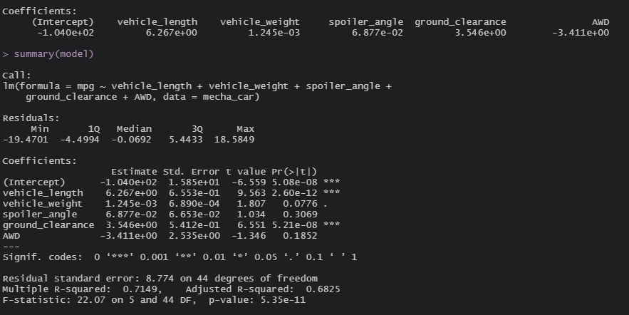

# mechacar_statistical_analysis

## Linear Regression to Predict MPG

- As can be seen from the summary above, the variables that provided a non-random amount of variance to the MPG variable are the vehicle length and the ground clearance of the vehicles.
- The general linear model returns a p-value of 5.35E-11 which is much below the significance level of 0.05 indicating that the null hypothesis should be rejected.
In other words there is statistically significant evidence that the null hypothesis can be rejected implying that slope of the general linear model is not zero.
- The general linear model accurately predicts the MPG of the MechaCar prototypes because the multiple R^2 value is 0.7149 and the adjusted R^2 value is 0.6825.
Both of these being close to each other and near 0.7 (maximum of 1) indicates that the model isn't overfit.

## Summary Statistics on Suspension Coils

## T-Tests on Suspension Coils

## Study Design: MechaCar vs Competition