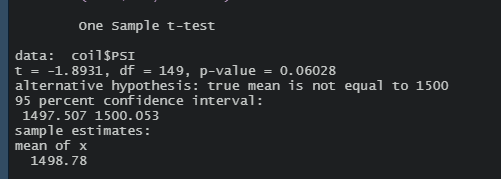

# mechacar_statistical_analysis

## Linear Regression to Predict MPG
### MPG Linear Regression Results

- As can be seen from the summary above, the variables that provided a non-random amount of variance to the MPG variable are the vehicle length and the ground clearance of the vehicles.
- The general linear model returns a p-value of 5.35E-11 which is much below the significance level of 0.05 indicating that the null hypothesis should be rejected.
In other words there is statistically significant evidence that the null hypothesis can be rejected implying that slope of the general linear model is not zero.
- The general linear model accurately predicts the MPG of the MechaCar prototypes because the multiple R2 value is 0.7149 and the adjusted R2 value is 0.6825.
Both of these being close to each other and near 0.7 (maximum of 1) indicates that the model isn't overfit.
This would be the case if the multiple R2 value was high but the adjusted R2 value was low.

## Summary Statistics on Suspension Coils
### Summary Statistics for the Population

- The mean for the population of MechaCar suspension coils can be seen to be 1498.78 PSI from the summary above (along with other summary statistics).
### Summary Statistics by Lot

- The means for the individual productions can be seen in the table above (along with other summary statistics).
- Lots 1 and 2 can be seen to have Variances well below 100 (PSI)2
- Lot 3 has a Variance approximately 170 (PSI2 which is much higher than the allowable of 100.
- This indicates that the processes and factors that went into the manufacture of the third lot of suspension coils would warrant potential investigation.

## T-Tests on Suspension Coils

### T-Test Results of Population

- One can observe that the p-value is higher than the significance level of 0.05.
This indicates that the population of suspension coils does not have enough evidence to reject the null hypothesis.
Thus on the whole the suspension coils weight capacities are not sufficiently different from the expected mean of 1500 PSI.
### T-Test Results by Lot

- In the T-Test Results by Lot output seen above one observes that lots 1 and 2 have p-values much larger than the significance level of 0.05.
This indicates that there is not sufficient evidence to reject the null hypothesis and one concludes that the means of the weight capacities of lots 1 and 2 are not different from the population mean of 1500 PSI.
- Unlike lots 1 and 2, one can see that lot 3 has a p-value of less than 0.05.
This indicates that there is sufficient evidence to reject the null hypothesis and that the mean weight capacity of the coils produced in lot 3 are statistically significantly different from the population average of 1500 PSI.
This conclusion is intuitively backed by the large standard deviation observed in lot 3 from Deliverable 2.

## Study Design: MechaCar vs Competition
A statistical test for the MechaCar's highway and city MPG could be conducted.
Over a period of weeks or months, several Mechacar's city and highway MPG could be measured.
This data could then be compared using one sided t-tests to other vehicles MPG means.
The null hypothesis (H0) could be defined as "the MechaCar city/highway MPG is not greater than that of other similar vehicles."
The alternative hypothesis (Ha) would then be "the MechaCar city/highway MPG is greater than that of other similar vehicles."
Using this sort of t-test would allow one to statistically conclude if MechaCar outperforms competition on the metric of fuel efficiency.